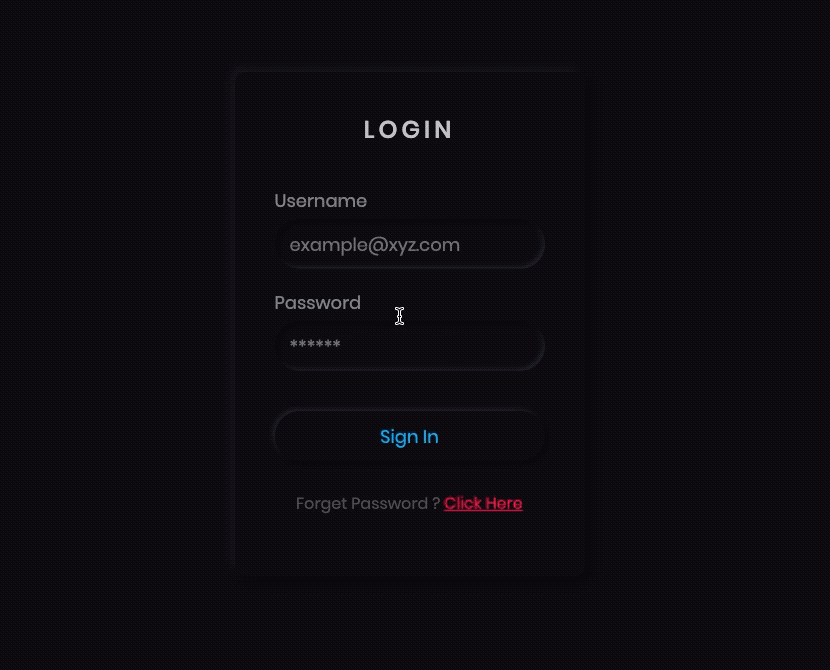
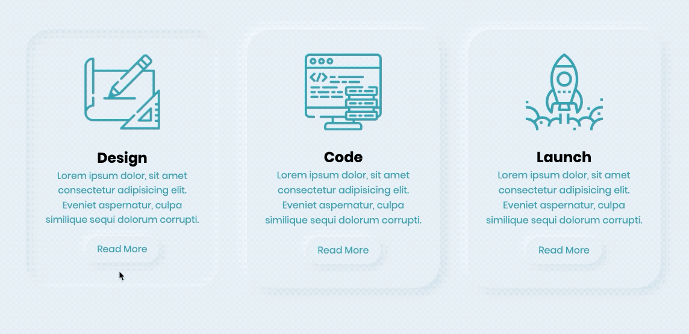
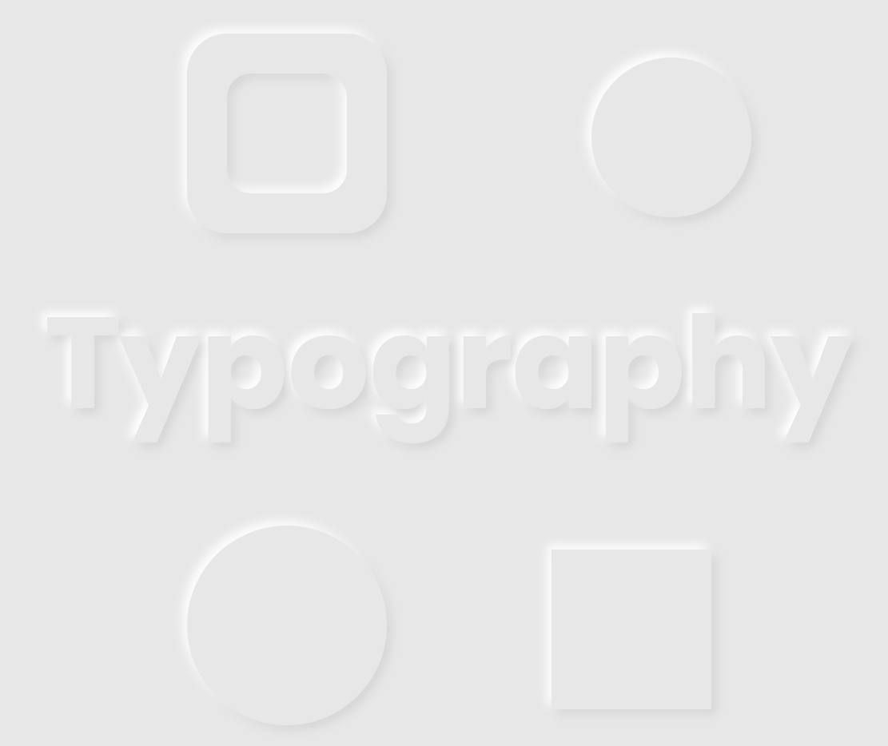

# Neumorphism ui style 😀

- [Dark Mode / Login Form](https://github.com/jshacker9999/dev/tree/main/neumorphism/dark-mode/login-form)

- [Neumorphism Card UI Hover Effects](https://github.com/jshacker9999/dev/tree/main/neumorphism/neumorphism-card-ui-hover-effects)

- [Neumorphism Typography and Shape](https://github.com/jshacker9999/dev/tree/main/neumorphism/typography-and-shape)

---

