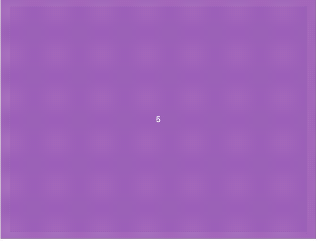

# Slider Effect List 😀

- [3D Responsive Touch Slider](https://github.com/jshacker9999/dev/tree/main/slider/3d-responsive-touch-slider)

- [Box Slider Hover Effects](https://github.com/jshacker9999/dev/tree/main/slider/box-slider-hover-effects)

- [Capture Effect Slider](https://github.com/jshacker9999/dev/tree/main/slider/capture-effect-slider)

- [Simple Vanilla JS Carousel Slider](https://github.com/jshacker9999/dev/tree/main/slider/simple-vanilla-js-carousel-slider)

---

